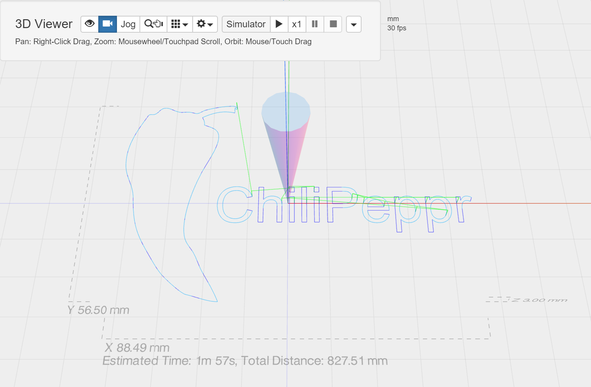

# com-chilipeppr-widget-3dviewer
Visualize your GCode in 3D by simulating your GCode run or seeing where your run is at in 3D while your CNC operation is in action.



## ChiliPeppr Widget / 3D GCode Viewer

All ChiliPeppr widgets/elements are defined using cpdefine() which is a method
that mimics require.js. Each defined object must have a unique ID so it does
not conflict with other ChiliPeppr widgets.

| Item                  | Value           |
| -------------         | ------------- | 
| ID                    | com-chilipeppr-widget-3dviewer |
| Name                  | Widget / 3D GCode Viewer |
| Description           | Visualize your GCode in 3D by simulating your GCode run or seeing where your run is at in 3D while your CNC operation is in action. |
| chilipeppr.load() URL | http://raw.githubusercontent.com/chilipeppr/widget-3dviewer/master/auto-generated-widget.html |
| Edit URL              | http://ide.c9.io/chilipeppr/widget-3dviewer |
| Github URL            | http://github.com/chilipeppr/widget-3dviewer |
| Test URL              | https://preview.c9users.io/chilipeppr/widget-3dviewer/widget.html |

## Example Code for chilipeppr.load() Statement

You can use the code below as a starting point for instantiating this widget 
inside a workspace or from another widget. The key is that you need to load 
your widget inlined into a div so the DOM can parse your HTML, CSS, and 
Javascript. Then you use cprequire() to find your widget's Javascript and get 
back the instance of it.

```javascript
chilipeppr.load(
  "#myDivWidgetInsertedInto",
  "http://raw.githubusercontent.com/chilipeppr/widget-3dviewer/master/auto-generated-widget.html",
  function() {
    // Callback after widget loaded into #myDivWidgetInsertedInto
    cprequire(
      ["inline:com-chilipeppr-widget-3dviewer"], // the id you gave your widget
      function(mywidget) {
        // Callback that is passed reference to your newly loaded widget
        console.log("My widget just got loaded.", mywidget);
        mywidget.init();
      }
    );
  }
);

```

## Publish

This widget/element publishes the following signals. These signals are owned by this widget/element and are published to all objects inside the ChiliPeppr environment that listen to them via the 
chilipeppr.subscribe(signal, callback) method. 
To better understand how ChiliPeppr's subscribe() method works see amplify.js's documentation at http://amplifyjs.com/api/pubsub/

  <table id="com-chilipeppr-elem-pubsubviewer-pub" class="table table-bordered table-striped">
      <thead>
          <tr>
              <th style="">Signal</th>
              <th style="">Description</th>
          </tr>
      </thead>
      <tbody>
      <tr valign="top"><td>/com-chilipeppr-widget-3dviewer/recv3dObject</td><td>When you send a /request3dObject you will receive a signal back of /recv3dObject. This signal has a payload of the THREE.js user object being shown in the 3D viewer.</td></tr><tr valign="top"><td>/com-chilipeppr-widget-3dviewer/recvUnits</td><td>When you send a /requestUnits you will receive back this signal with a payload of "mm" or "inch" as a string. Please also see /unitsChanged in case you want to know whenever units are changed from a file open event. You can request what units the Gcode are in from the 3D Viewer. Since the 3D Viewer parses Gcode, it can determine the units. The 3D Viewer is mostly unit agnostic, however to draw the toolhead, grid, and extents labels it does need to know the units to draw the decorations in a somewhat appropriate size.</td></tr><tr valign="top"><td>/com-chilipeppr-widget-3dviewer/unitsChanged</td><td>This signal is published when the user loads a new file into the 3D viewer and the units change. If other widgets need to know what units are being used, you should subscribe to this signal to be notified on demand.</td></tr><tr valign="top"><td>/com-chilipeppr-widget-3dviewer/sceneReloaded</td><td>This signal is sent when the scene has been (re)load because the user dragged / dropped. The payload indicates the global bounding box of the scene. This signal is similar to listening to /com-chilipeppr-elem-dragdrop/ondropped however, /sceneReloaded is guaranteed to fire every time the 3D viewer loads a new file into the viewer. Credit for this signal goes to Dat Chu who created it for his GrblLaser workspace.</td></tr>    
      </tbody>
  </table>

## Subscribe

This widget/element subscribes to the following signals. These signals are owned by this widget/element. Other objects inside the ChiliPeppr environment can publish to these signals via the chilipeppr.publish(signal, data) method. 
To better understand how ChiliPeppr's publish() method works see amplify.js's documentation at http://amplifyjs.com/api/pubsub/

  <table id="com-chilipeppr-elem-pubsubviewer-sub" class="table table-bordered table-striped">
      <thead>
          <tr>
              <th style="">Signal</th>
              <th style="">Description</th>
          </tr>
      </thead>
      <tbody>
      <tr valign="top"><td>/com-chilipeppr-widget-3dviewer/gotoline</td><td>This widget subscribes to this channel so other widgets can move the toolhead and highlight the Gcode line being worked on. This would mostly be when sending Gcode from a Gcode viewer/sender widget, that widget can have the 3D view follow along. Just the line number should be sent as the 3D viewer has it's own cache of the Gcode data loaded.</td></tr><tr valign="top"><td>/com-chilipeppr-widget-3dviewer/resize</td><td>You can ask this widget to resize itself. It will resize the rendering area to the region it is bound to (typically the window width/height).</td></tr><tr valign="top"><td>/com-chilipeppr-widget-3dviewer/sceneadd</td><td>You can send Threejs objects to this widget and they will be added to the scene. You must send true THREE.Line() or other ThreeJS objects in that are added as scene.add() objects.</td></tr><tr valign="top"><td>/com-chilipeppr-widget-3dviewer/sceneremove</td><td>You can also remove objects from the 3D scene. This is the opposite of /sceneadd</td></tr><tr valign="top"><td>/com-chilipeppr-widget-3dviewer/sceneclear</td><td>This resets the 3D viewer and clears the scene. It keeps the axes, toolhead, and grid. The user object and extents is removed.</td></tr><tr valign="top"><td>/com-chilipeppr-widget-3dviewer/drawextents</td><td>This asks the 3D viewer to draw the extents of what it is showing.</td></tr><tr valign="top"><td>/com-chilipeppr-widget-3dviewer/viewextents</td><td>This asks the 3D viewer to place the entire 3D object set in the view window from a front facing position. It is the equivalent of the button with the "eye" icon in the toolbar.</td></tr><tr valign="top"><td>/com-chilipeppr-widget-3dviewer/setunits</td><td>Pass in a string of "mm" or "inch" to set the units for the 3D Viewer.</td></tr><tr valign="top"><td>/com-chilipeppr-widget-3dviewer/wakeanimate</td><td>The 3d viewer sleeps the rendering after 5 seconds. So if you are going to do any updates to the 3D scene you should wake the animation before your update. It will timeout on its own so you don't have to worry about it. /sceneadd and /sceneremove do their own waking so you don't need to ask for it on those.</td></tr><tr valign="top"><td>/com-chilipeppr-widget-3dviewer/request3dObject</td><td>You can request the parent-most object that is showing in the 3D viewer. This is a THREE.js object that is generated by the 3D viewer. It contains all user elements shown in the scene. It does not contain the XYZ axis, toolhead, or other system elements. When you send this signal you will receive a publish back on /recv3dObject</td></tr><tr valign="top"><td>/com-chilipeppr-widget-3dviewer/requestUnits</td><td>Send in this signal and you will be sent back a /recvUnits with a payload of "mm" or "inch" as a string. Please also see /unitsChanged in case you want to know whenever units are changed from a file open event. You can request what units the Gcode are in from the 3D Viewer. Since the 3D Viewer parses Gcode, it can determine the units. The 3D Viewer is mostly unit agnostic, however to draw the toolhead, grid, and extents labels it does need to know the units to draw the decorations in a somewhat appropriate size.</td></tr>    
      </tbody>
  </table>

## Foreign Publish

This widget/element publishes to the following signals that are owned by other objects. 
To better understand how ChiliPeppr's subscribe() method works see amplify.js's documentation at http://amplifyjs.com/api/pubsub/

  <table id="com-chilipeppr-elem-pubsubviewer-foreignpub" class="table table-bordered table-striped">
      <thead>
          <tr>
              <th style="">Signal</th>
              <th style="">Description</th>
          </tr>
      </thead>
      <tbody>
      <tr><td colspan="2">(No signals defined in this widget/element)</td></tr>    
      </tbody>
  </table>

## Foreign Subscribe

This widget/element publishes to the following signals that are owned by other objects.
To better understand how ChiliPeppr's publish() method works see amplify.js's documentation at http://amplifyjs.com/api/pubsub/

  <table id="com-chilipeppr-elem-pubsubviewer-foreignsub" class="table table-bordered table-striped">
      <thead>
          <tr>
              <th style="">Signal</th>
              <th style="">Description</th>
          </tr>
      </thead>
      <tbody>
      <tr valign="top"><td>/com-chilipeppr-widget-3dviewer/com-chilipeppr-interface-cnccontroller/axes</td><td>If we see this signal come in, we move the toolhead to the xyz position in the payload of the signal.</td></tr><tr valign="top"><td>/com-chilipeppr-widget-3dviewer/com-chilipeppr-elem-dragdrop/ondropped</td><td>When a user drags and drops a file to the main window, we want to get notified so we can load it into the 3D viewer. During development mode in JSFiddle, this widget loads it's own com-chilipeppr-elem-dragdrop so you can test development, but when this widget is loaded in a full ChiliPeppr app it uses the global com-chilipeppr-elem-dragdrop.</td></tr>    
      </tbody>
  </table>

## Methods / Properties

The table below shows, in order, the methods and properties inside the widget/element.

  <table id="com-chilipeppr-elem-methodsprops" class="table table-bordered table-striped">
      <thead>
          <tr>
              <th style="">Method / Property</th>
              <th>Type</th>
              <th style="">Description</th>
          </tr>
      </thead>
      <tbody>
      <tr valign="top"><td>id</td><td>string</td><td>"com-chilipeppr-widget-3dviewer"</td></tr><tr valign="top"><td>name</td><td>string</td><td>"Widget / 3D GCode Viewer"</td></tr><tr valign="top"><td>desc</td><td>string</td><td>"Visualize your GCode in 3D by simulating your GCode run or seeing where your run is at in 3D while your CNC operation is in action."</td></tr><tr valign="top"><td>url</td><td>string</td><td>"http://raw.githubusercontent.com/chilipeppr/widget-3dviewer/master/auto-generated-widget.html"</td></tr><tr valign="top"><td>fiddleurl</td><td>string</td><td>"http://ide.c9.io/chilipeppr/widget-3dviewer"</td></tr><tr valign="top"><td>githuburl</td><td>string</td><td>"http://github.com/chilipeppr/widget-3dviewer"</td></tr><tr valign="top"><td>testurl</td><td>string</td><td>"http://widget-3dviewer-chilipeppr.c9users.io/widget.html"</td></tr><tr valign="top"><td>publish</td><td>object</td><td>Please see docs above.</td></tr><tr valign="top"><td>subscribe</td><td>object</td><td>Please see docs above.</td></tr><tr valign="top"><td>foreignSubscribe</td><td>object</td><td>Please see docs above.</td></tr><tr valign="top"><td>foreignPublish</td><td>object</td><td>Please see docs above.</td></tr><tr valign="top"><td>scene</td><td>object</td><td></td></tr><tr valign="top"><td>object</td><td>object</td><td></td></tr><tr valign="top"><td>camera</td><td>object</td><td></td></tr><tr valign="top"><td>controls</td><td>object</td><td></td></tr><tr valign="top"><td>toolhead</td><td>object</td><td></td></tr><tr valign="top"><td>tween</td><td>object</td><td></td></tr><tr valign="top"><td>tweenHighlight</td><td>object</td><td></td></tr><tr valign="top"><td>tweenIndex</td><td>object</td><td></td></tr><tr valign="top"><td>tweenSpeed</td><td>number</td><td></td></tr><tr valign="top"><td>tweenPaused</td><td>boolean</td><td></td></tr><tr valign="top"><td>tweenIsPlaying</td><td>boolean</td><td></td></tr><tr valign="top"><td>wantAnimate</td><td>boolean</td><td></td></tr><tr valign="top"><td>initOptions</td><td>object</td><td></td></tr><tr valign="top"><td>init</td><td>function</td><td>function (initOptions) </td></tr><tr valign="top"><td>setupScenePubSub</td><td>function</td><td>function () </td></tr><tr valign="top"><td>onSignalSceneReloadedFailAttempts</td><td>number</td><td></td></tr><tr valign="top"><td>onSignalSceneReloaded</td><td>function</td><td>function () </td></tr><tr valign="top"><td>isInspectSelect</td><td>boolean</td><td></td></tr><tr valign="top"><td>initInspect</td><td>function</td><td>function () </td></tr><tr valign="top"><td>setupInspect</td><td>function</td><td>function (evt) </td></tr><tr valign="top"><td>unsetupInspect</td><td>function</td><td>function () </td></tr><tr valign="top"><td>toggleInspect</td><td>function</td><td>function (evt) </td></tr><tr valign="top"><td>inspectKeyDown</td><td>function</td><td>function (evt) </td></tr><tr valign="top"><td>inspectKeyUp</td><td>function</td><td>function (evt) </td></tr><tr valign="top"><td>inspectMouseClick</td><td>function</td><td>function (evt) </td></tr><tr valign="top"><td>onInspectGoto</td><td>function</td><td>function (evt) </td></tr><tr valign="top"><td>inspectArrowGrp</td><td>object</td><td></td></tr><tr valign="top"><td>createInspectArrow</td><td>function</td><td>function () </td></tr><tr valign="top"><td>inspectCurPos</td><td>object</td><td></td></tr><tr valign="top"><td>inspectLastObj</td><td>object</td><td></td></tr><tr valign="top"><td>inspectLastDecorateGroup</td><td>object</td><td></td></tr><tr valign="top"><td>inspectDlgEl</td><td>object</td><td></td></tr><tr valign="top"><td>inspectMouseMove</td><td>function</td><td>function (evt) </td></tr><tr valign="top"><td>createGlow</td><td>function</td><td>function (threeObj) </td></tr><tr valign="top"><td>createGlowCubeCaps</td><td>function</td><td>function (threeObj) </td></tr><tr valign="top"><td>isJogBtnAttached</td><td>boolean</td><td></td></tr><tr valign="top"><td>isJogSelect</td><td>boolean</td><td></td></tr><tr valign="top"><td>initJog</td><td>function</td><td>function () </td></tr><tr valign="top"><td>setupJog</td><td>function</td><td>function (evt) </td></tr><tr valign="top"><td>unsetupJog</td><td>function</td><td>function () </td></tr><tr valign="top"><td>toggleJog</td><td>function</td><td>function (evt) </td></tr><tr valign="top"><td>jogKeyDown</td><td>function</td><td>function (evt) </td></tr><tr valign="top"><td>jogKeyUp</td><td>function</td><td>function (evt) </td></tr><tr valign="top"><td>arrowHelper</td><td>object</td><td></td></tr><tr valign="top"><td>jogPlane</td><td>object</td><td></td></tr><tr valign="top"><td>isJogRaycaster</td><td>boolean</td><td></td></tr><tr valign="top"><td>jogArrow</td><td>object</td><td></td></tr><tr valign="top"><td>jogArrowCyl</td><td>object</td><td></td></tr><tr valign="top"><td>jogArrowLine</td><td>object</td><td></td></tr><tr valign="top"><td>jogArrowShadow</td><td>object</td><td></td></tr><tr valign="top"><td>unsetupJogRaycaster</td><td>function</td><td>function () </td></tr><tr valign="top"><td>setupJogRaycaster</td><td>function</td><td>function () </td></tr><tr valign="top"><td>jogMouseClick</td><td>function</td><td>function (evt) </td></tr><tr valign="top"><td>jogCurPos</td><td>object</td><td></td></tr><tr valign="top"><td>jogMouseMove</td><td>function</td><td>function (evt) </td></tr><tr valign="top"><td>showShadow</td><td>boolean</td><td></td></tr><tr valign="top"><td>setupCogMenu</td><td>function</td><td>function () </td></tr><tr valign="top"><td>onToggleShadowClick</td><td>function</td><td>function (evt, param) </td></tr><tr valign="top"><td>setupFpsMenu</td><td>function</td><td>function () </td></tr><tr valign="top"><td>onFpsClick</td><td>function</td><td>function (evt, param) </td></tr><tr valign="top"><td>gridSize</td><td>number</td><td></td></tr><tr valign="top"><td>setupGridSizeMenu</td><td>function</td><td>function () </td></tr><tr valign="top"><td>onGridSizeClick</td><td>function</td><td>function (evt, param) </td></tr><tr valign="top"><td>setUnits</td><td>function</td><td>function (units) </td></tr><tr valign="top"><td>requestUnits</td><td>function</td><td>function () </td></tr><tr valign="top"><td>onUnitsChanged</td><td>function</td><td>function () </td></tr><tr valign="top"><td>request3dObject</td><td>function</td><td>function () </td></tr><tr valign="top"><td>sceneAdd</td><td>function</td><td>function (obj) </td></tr><tr valign="top"><td>sceneRemove</td><td>function</td><td>function (obj) </td></tr><tr valign="top"><td>sceneClear</td><td>function</td><td>function () </td></tr><tr valign="top"><td>btnSetup</td><td>function</td><td>function () </td></tr><tr valign="top"><td>forkSetup</td><td>function</td><td>function () </td></tr><tr valign="top"><td>onPubSubFileLoaded</td><td>function</td><td>function (txt) </td></tr><tr valign="top"><td>error</td><td>function</td><td>function (msg) </td></tr><tr valign="top"><td>loadFile</td><td>function</td><td>function (path, callback /* function(contents) */ ) </td></tr><tr valign="top"><td>setDetails</td><td>function</td><td>function (txt) </td></tr><tr valign="top"><td>speedUp</td><td>function</td><td>function () </td></tr><tr valign="top"><td>openGCodeFromPath</td><td>function</td><td>function (path) </td></tr><tr valign="top"><td>openGCodeFromText</td><td>function</td><td>function (gcode) </td></tr><tr valign="top"><td>lookAtCenter</td><td>function</td><td>function () </td></tr><tr valign="top"><td>isLookAtToolHeadMode</td><td>boolean</td><td></td></tr><tr valign="top"><td>lookAtToolHead</td><td>function</td><td>function () </td></tr><tr valign="top"><td>toCameraCoords</td><td>function</td><td>function (position) </td></tr><tr valign="top"><td>scaleInView</td><td>function</td><td>function () </td></tr><tr valign="top"><td>viewExtents</td><td>function</td><td>function () </td></tr><tr valign="top"><td>stopSampleRun</td><td>function</td><td>function (evt) </td></tr><tr valign="top"><td>pauseSampleRun</td><td>function</td><td>function () </td></tr><tr valign="top"><td>gotoXyz</td><td>function</td><td>function (data) </td></tr><tr valign="top"><td>gotoLine</td><td>function</td><td>function (data) </td></tr><tr valign="top"><td>playNextTween</td><td>function</td><td>function (isGotoLine) </td></tr><tr valign="top"><td>zheighttest</td><td>number</td><td></td></tr><tr valign="top"><td>playSampleRun</td><td>function</td><td>function (evt) </td></tr><tr valign="top"><td>makeText</td><td>function</td><td>function (vals) </td></tr><tr valign="top"><td>decorate</td><td>object</td><td></td></tr><tr valign="top"><td>decorateExtents</td><td>function</td><td>function () </td></tr><tr valign="top"><td>convertMinsToPrettyDuration</td><td>function</td><td>function (mins) </td></tr><tr valign="top"><td>makeSprite</td><td>function</td><td>function (scene, rendererType, vals) </td></tr><tr valign="top"><td>element</td><td>object</td><td></td></tr><tr valign="top"><td>isUnitsMm</td><td>boolean</td><td></td></tr><tr valign="top"><td>getInchesFromMm</td><td>function</td><td>function (mm) </td></tr><tr valign="top"><td>getUnitVal</td><td>function</td><td>function (val) </td></tr><tr valign="top"><td>drawAxesToolAndExtents</td><td>function</td><td>function () </td></tr><tr valign="top"><td>shadowplane</td><td>object</td><td></td></tr><tr valign="top"><td>drawToolhead</td><td>function</td><td>function () </td></tr><tr valign="top"><td>grid</td><td>object</td><td></td></tr><tr valign="top"><td>gridTurnOff</td><td>function</td><td>function () </td></tr><tr valign="top"><td>gridTurnOn</td><td>function</td><td>function () </td></tr><tr valign="top"><td>drawGrid</td><td>function</td><td>function () </td></tr><tr valign="top"><td>drawExtentsLabels</td><td>function</td><td>function () </td></tr><tr valign="top"><td>axes</td><td>object</td><td></td></tr><tr valign="top"><td>drawAxes</td><td>function</td><td>function () </td></tr><tr valign="top"><td>colorBackground</td><td>number</td><td></td></tr><tr valign="top"><td>createScene</td><td>function</td><td>function (element) </td></tr><tr valign="top"><td>resize</td><td>function</td><td>function () </td></tr><tr valign="top"><td>mytimeout</td><td>object</td><td></td></tr><tr valign="top"><td>renderFrameCtr</td><td>number</td><td></td></tr><tr valign="top"><td>fpsCounterInterval</td><td>object</td><td></td></tr><tr valign="top"><td>fpsEl</td><td>object</td><td></td></tr><tr valign="top"><td>fpsCounterStart</td><td>function</td><td>function () </td></tr><tr valign="top"><td>fpsCounterOnInterval</td><td>function</td><td>function () </td></tr><tr valign="top"><td>fpsCounterEnd</td><td>function</td><td>function () </td></tr><tr valign="top"><td>setFrameRate</td><td>function</td><td>function (rate) </td></tr><tr valign="top"><td>animEnable</td><td>boolean</td><td></td></tr><tr valign="top"><td>animateDisabled</td><td>function</td><td>function () </td></tr><tr valign="top"><td>animateEnabled</td><td>function</td><td>function () </td></tr><tr valign="top"><td>frameRateDelayMs</td><td>number</td><td></td></tr><tr valign="top"><td>animate</td><td>function</td><td>function () </td></tr><tr valign="top"><td>wakeAnimate</td><td>function</td><td>function (evt) </td></tr><tr valign="top"><td>sleepAnimate</td><td>function</td><td>function () </td></tr><tr valign="top"><td>cancelSleep</td><td>function</td><td>function () </td></tr><tr valign="top"><td>isNoSleepMode</td><td>boolean</td><td></td></tr><tr valign="top"><td>animNoSleep</td><td>function</td><td>function () </td></tr><tr valign="top"><td>animAllowSleep</td><td>function</td><td>function () </td></tr><tr valign="top"><td>GCodeParser</td><td>function</td><td>function (handlers) <br><br>Parses a string of gcode instructions, and invokes handlers for
each type of command.<br><br>Special handler:
'default': Called if no other handler matches.</td></tr><tr valign="top"><td>colorG0</td><td>number</td><td></td></tr><tr valign="top"><td>colorG1</td><td>number</td><td></td></tr><tr valign="top"><td>colorG2</td><td>number</td><td></td></tr><tr valign="top"><td>createObjectFromGCode</td><td>function</td><td>function (gcode, indxMax) </td></tr><tr valign="top"><td>convertLineGeometryToBufferGeometry</td><td>function</td><td>function (lineGeometry, color) </td></tr>
      </tbody>
  </table>


## About ChiliPeppr

[ChiliPeppr](http://chilipeppr.com) is a hardware fiddle, meaning it is a 
website that lets you easily
create a workspace to fiddle with your hardware from software. ChiliPeppr provides
a [Serial Port JSON Server](https://github.com/johnlauer/serial-port-json-server) 
that you run locally on your computer, or remotely on another computer, to connect to 
the serial port of your hardware like an Arduino or other microcontroller.

You then create a workspace at ChiliPeppr.com that connects to your hardware 
by starting from scratch or forking somebody else's
workspace that is close to what you are after. Then you write widgets in
Javascript that interact with your hardware by forking the base template 
widget or forking another widget that
is similar to what you are trying to build.

ChiliPeppr is massively capable such that the workspaces for 
[TinyG](http://chilipeppr.com/tinyg) and [Grbl](http://chilipeppr.com/grbl) CNC 
controllers have become full-fledged CNC machine management software used by
tens of thousands.

ChiliPeppr has inspired many people in the hardware/software world to use the
browser and Javascript as the foundation for interacting with hardware. The
Arduino team in Italy caught wind of ChiliPeppr and now
ChiliPeppr's Serial Port JSON Server is the basis for the 
[Arduino's new web IDE](https://create.arduino.cc/). If the Arduino team is excited about building on top
of ChiliPeppr, what
will you build on top of it?

